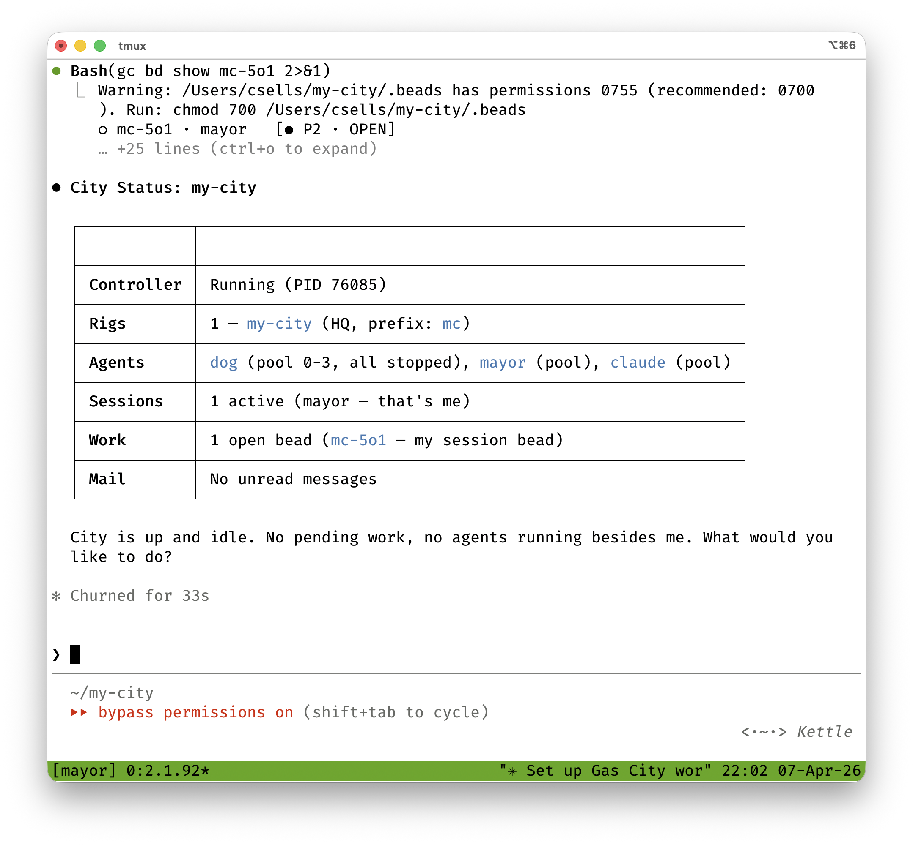
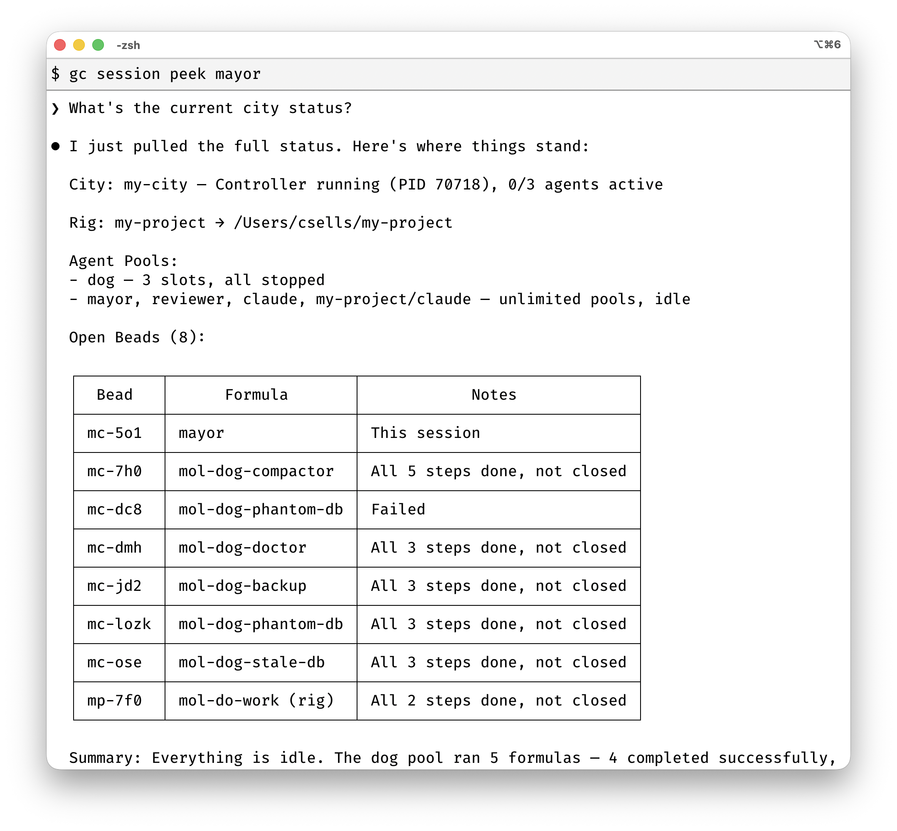

In [Tutorial 02](/tutorials/02-agents), you worked with agents to produce work,
which created sessions with agents that we haven't seen yet. In this tutorial,
you'll see and talk with agents via sessions as well as see how agents talk to
each other. You'll also learn the difference between "polecats" (agents spun up
on demand to handle work) and "crew" (persistent agents with named sessions),

To continue with this tutorial, you'll want to start from where the last
tutorial left off, with a `city.toml` that looks like the following and the
appropriate agent prompts and rig folders in place to match:

```shell
~/my-city
$ cat city.toml
[workspace]
name = "my-city"
provider = "claude"

[[agent]]
name = "mayor"
prompt_template = "prompts/mayor.md"

[[named_session]]
template = "mayor"
mode = "always"

[[agent]]
name = "reviewer"
prompt_template = "prompts/reviewer.md"
provider = "codex"

[[rigs]]
name = "my-project"
path = "/Users/csells/my-project"

[[rigs]]
name = "my-api"
path = "/Users/csells/my-api"
```

## Looking in on Polecats

Every provider — Claude, Codex, Gemini, etc. — has its own way of managing
conversations. Gas City normalizes all of that behind a single abstraction
called a **session**. A session is a live process with its own terminal, state,
and conversation history.

When you sling a bead, you're creating a session. You can peek at what's
happening in that session with the `gc session peek` command, passing in the
name of the agent you'd like to check in on:

```shell
~/my-project
$ gc session peek reviewer
› [my-city] reviewer • 2026-04-07T11:56:59

  Run `gc prime` to initialize your context.

  # Code Reviewer Agent
  You are an agent in a Gas City workspace. Check for available work and
  execute it.

  ## Your tools
  - `bd ready` — see available work items
  - `bd show <id>` — see details of a work item
  - `bd close <id>` — mark work as done

  ## How to work
  1. Check for available work: `bd ready`
  2. Pick a bead and execute the work described in its title
  3. When done, close it: `bd close <id>`
  4. Check for more work. Repeat until the queue is empty.

  ## Reviewing Code
  Read the code and provide feedback on bugs, security issues, and style.

... # content elided

• Ran bd ready --json
  └ warning: beads.role not configured (GH#2950).
      Fix: git config beads.role maintainer
    … +282 lines
      }
    ]

• The ready queue has one task that is explicitly routed to the reviewer agent:
  mc-p956, “Review hello.py and write review.md with feedback.” I’m pulling the
  bead details and the target file now, then I’ll write the review and close
  that item.

• Explored
  └ List rg --files -g hello.py -g review.md

• Ran bd show mc-p956 --json
  └ [
      {
    … +27 lines
      }
    ]

• Working (43s • esc to interrupt)
```

You'll notice that the result of `gc prime` for our reviewer agent as the first
input to the `codex` CLI. That's how GC lets Codex know how to act. Then you'll
notice Codex acting on those instructions by looking for the beads that are
ready for it to act on. It finds one, executes it and out comes our `review.md`
file.

When an agent has no work to do, it will go idle. And when it's been idle in a
session created for it to handle work that was slung to it, that session will be
cleanly shutdown by the GC supervisor process. These transient sessions are
often used by one-and-done agents know as "polecats". While you could talk to
one interactively, they're configured to execute beads, go idle and have their
sessions shutdown ASAP.

If you want an agent to to talk to, you'll want one configured for chatting
called a "crew" member.

## Chatting with Crew

Recall from our reviewer agent that it's prompt was authored to ask it to look
for and immediately start executing work assigned to it. While that work is
active, you can see it in the list of sessions:

```shell
~/my-project
$ gc session list
2026/04/07 21:50:21 tmux state cache: refreshed 2 sessions in 3.82725ms
ID       TEMPLATE  STATE     REASON          TITLE     AGE  LAST ACTIVE
mc-8sfd  reviewer  creating  create          reviewer  1s   -
mc-5o1   mayor     active    session,config  mayor     10h  14m ago
```

However, once the work is done, the reviewer will go idle and its session will
be shutdown by GC. On the other hand, you can see from this sample output that
the mayor has been running for the last ten hours -- since our city was started
-- but we haven't talked to it once? Has it been burning tokens all of this
time? Let's take a look:

```shell
~/my-project
$ gc session peek mayor --lines 3

City is up and idle. No pending work, no agents running besides me. What would
  you like to do?
```

So the mayor is clearly idle, but has not been shutdown. Why not? If you take a
look again at your `city.toml` file, you'll see why:

```toml
...
[[agent]]
name = "mayor"
prompt_template = "prompts/mayor.md"

[[named_session]]
template = "mayor"
mode = "always"
...
```

The mayor has a specially named session called "mayor" that is always running.
It's kept up but the system so that you can have quick access to it for a chat
or some planning or whatever you'd like to do. A polecat is designed to be
transient, but an agent is a member of your "crew" (whether city-wide or
rig-specific) if it's always around and ready to chat interactively or receive
work.

To talk to the mayor (or any agent in a running session), you "attach" to it:

```shell
~/my-project
$ gc session attach mayor
2026/04/07 22:03:26 tmux state cache: refreshed 1 sessions in 3.828541ms
Attaching to session mc-5o1 (mayor)...
```

And as soon as you do, you'll be dropped into [a tmux
session](https://github.com/tmux/tmux/wiki/Getting-Started):



You're in a live conversation. The agent responds just like any chat-based
coding assistant, but with the full context of its prompt template.

To detach without killing the session, press `Ctrl-b d` (the standard tmux
detach). The session keeps running in the background. You can reattach anytime.

You can also interact with running sessions without attaching. You've already
seen what peeking looks like. You can also "nudge" it, which types a new message
into the session's terminal:

```shell
~/my-city
$ gc session nudge mayor "What's the current city status?"
2026/04/07 22:07:28 tmux state cache: refreshed 2 sessions in 3.765375ms
Nudged mayor
```



To get a feel for whats's happening in your city, you can see all running
sessions:

```shell
~/my-city
$ gc session list
ID      ALIAS    TEMPLATE    STATE
my-2    —        helper      active
my-3    hal      helper      active
my-4    —        mayor       active
```

We'll pick up where Tutorial 02 left off. You should have `my-city` running with
`my-project` and `my-api` rigged, and agents for `mayor`, `helper`, `worker`,
and `reviewer`.

## Agents talking to each other

Up to this point, you've been managing sessions one at a time — creating them on
demand for polecats, keeping with alive as crew with named sessions. But a city
isn't a collection of independent agents working in isolation. It's a system of
agents that can talk to each other.

The agents in your city don't call each other directly. There are no function
calls between them, no shared memory, no direct references. Each session is its
own process with its own terminal, its own conversation history, and its own
provider. The mayor doesn't have a handle to a polecat or vice versa.

However, they can still coordinate with each other via **mail** and **slung
work**. Both are indirect — the sender doesn't need to know which session
receives the message or which instance picks up the task. Gas City handles the
routing.

This indirection is deliberate. Because agents don't hold references to each
other, they can run, go idle, restart, and scale independently. The mayor can
dispatch work to "the reviewer" without knowing whether there's one reviewer
session or five, whether it's on Claude or Codex, or whether it's currently
active or idle. The work and the messages persist in the store. The sessions
come and go.

Mail is the primary way agents talk to each other. Slung work — `gc sling` — is
how they delegate tasks. Let's look at both.

## Mail

Mail creates a persistent, tracked message that the recipient picks up on its
next turn. Unlike nudge (which is ephemeral terminal input), mail survives
crashes, has a subject line, and stays unread until the agent processes it.

Send mail to the mayor:

```shell
~/my-city
$ gc mail send mayor -s "Review needed" -m "Please look at the auth module changes in my-project"
Sent message mc-wisp-8t8 to mayor
```

`gc mail send` takes the recipient as a positional argument and the subject/body
via `-s`/`-m` flags. (You can also pass just `<to> <body>` with no subject.)

Check for unread mail:

```shell
~/my-city
$ gc mail check mayor
1 unread message(s) for mayor
```

See the inbox:

```shell
~/my-city
$ gc mail inbox mayor
ID           FROM   SUBJECT        BODY
mc-wisp-8t8  human  Review needed  Please look at the auth module changes in my-project
```

`gc mail inbox` defaults to unread messages, so there's no STATE column —
everything listed is unread by definition.

The mayor doesn't have to manually check its inbox. Gas City installs provider
hooks that surface unread mail automatically — on each turn, a hook runs `gc
mail check --inject`, and if there's unread mail, it appears as a system
reminder in the agent's context. The agent sees its mail without doing anything.

This is what the mayor's nudge — "Check mail and hook status, then act
accordingly" — is about. When the mayor wakes up or starts a new turn, hooks
deliver any pending mail, and the nudge tells it to act on what it finds.

## Slinging beads to coordinate agents

Here's what coordination looks like in practice. The mayor reads the mail
message you sent. It decides the reviewer should handle it, so it slings the
work:

```shell
~/my-city
$ gc session peek mayor --lines 6
[mayor] Got mail: "Review needed" — auth module changes in my-project
[mayor] Routing to reviewer...
[mayor] Running: gc sling my-project/reviewer "Review the auth module changes"
```

(The above is illustrative — `peek` returns the actual terminal contents of the
session, so you'll see whatever the agent has rendered, not Gas City–formatted
lines.)

The mayor didn't talk to the reviewer directly. It slung a bead to the reviewer
agent template, and Gas City figured out which session picks it up. If the
reviewer was asleep, Gas City woke it. If there were multiple reviewer sessions,
Gas City routed the work to an available one. The mayor doesn't know or care
about any of that — it describes the work and slings it.

This is the pattern that scales. A human sends mail to the mayor. The mayor
reads it, plans the work, and slings tasks to agents. Those agents do the work
and close their beads. Everyone communicates through the store, not through
direct connections. Sessions come and go; the work persists.

## Hooks

Hooks are what make all of this work behind the scenes. Without hooks, a session
is just a bare provider process — Claude running in a terminal, with no
awareness of Gas City. Hooks wire the provider's event system into Gas City so
agents can receive mail, pick up slung work, and drain queued nudges
automatically.

The tutorial template sets hooks at the workspace level, so all your agents
already have them:

```toml
[workspace]
install_agent_hooks = ["claude"]
```

You can also set them per agent:

```toml
[[agent]]
name = "mayor"
install_agent_hooks = ["claude"]
```

When a session starts, Gas City installs hook configuration files that the
provider reads. For Claude, this means a `hooks/claude.json` file that fires Gas
City commands at key moments — session start, before each turn, on shutdown.
Those commands deliver mail, drain nudges, and surface pending work.

Without hooks, you'd have to manually tell each agent to run `gc mail check` and
`gc prime`. With hooks, it happens on every turn.

## Session logs

Peek shows the last few lines of terminal output. Logs show the full
conversation history:

```shell
~/my-city
$ gc session logs mayor --tail 1
07:22:29 [USER] [my-city] mayor • 2026-04-08T00:22:24
Check the status of mc-wisp-8t8

07:22:31 [ASSISTANT] [my-city] mayor • 2026-04-08T00:22:31
mc-wisp-8t8 is a review request for the auth module. I've routed it to
my-project/reviewer.
```

Note that `--tail` here counts compaction _segments_, not lines — `--tail 1`
shows the most recent segment, `--tail 0` shows all of them. Follow live output
with `-f`:

```shell
~/my-city
$ gc session logs mayor -f
```

Useful for watching what a background agent is doing without attaching and
potentially interrupting it. Peek shows the terminal; logs show the
conversation.

## What's next

You've seen how sessions are created on demand for slung work, how named
sessions keep agents alive, how mail and hooks enable agents to coordinate as a
team, and how to manage session lifecycle. From here:

- **[Formulas](/tutorials/04-formulas)** — multi-step workflow templates with
  dependencies and variables
- **[Beads](/tutorials/05-beads)** — the work tracking system underneath it all
