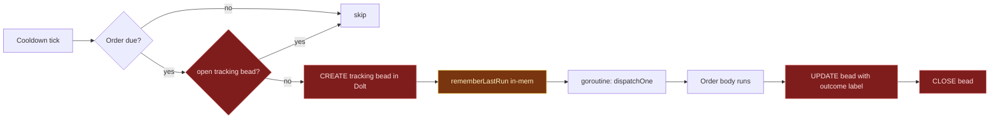
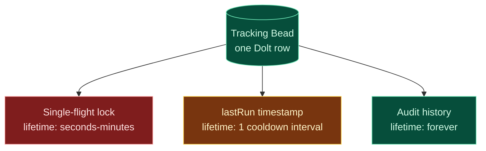
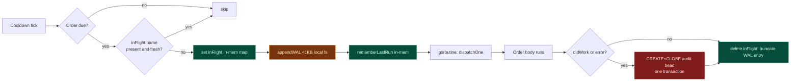
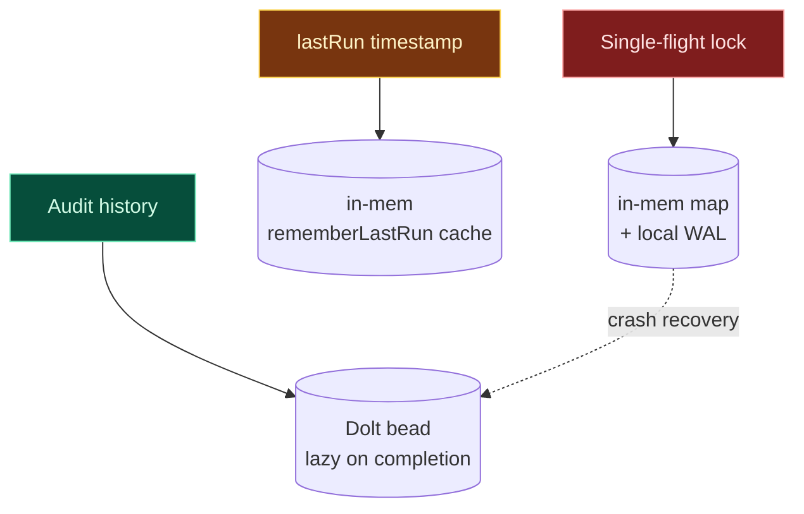
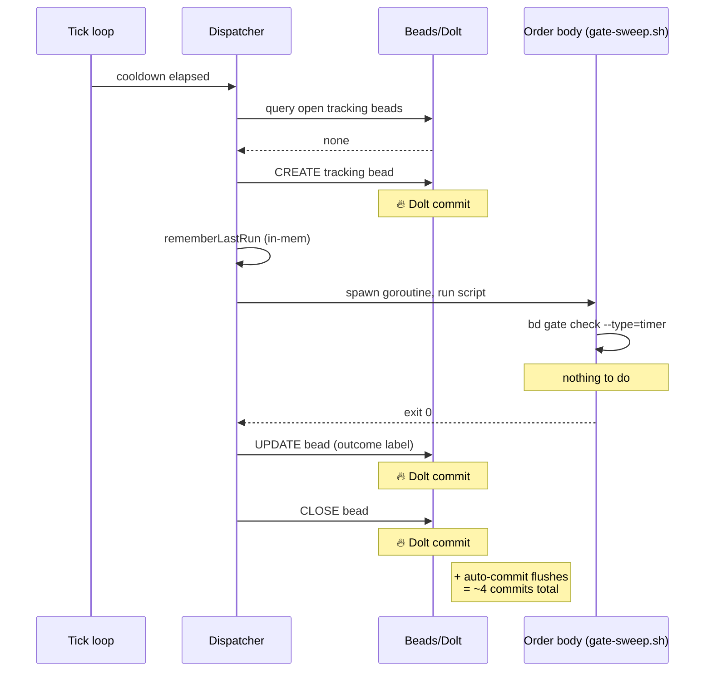
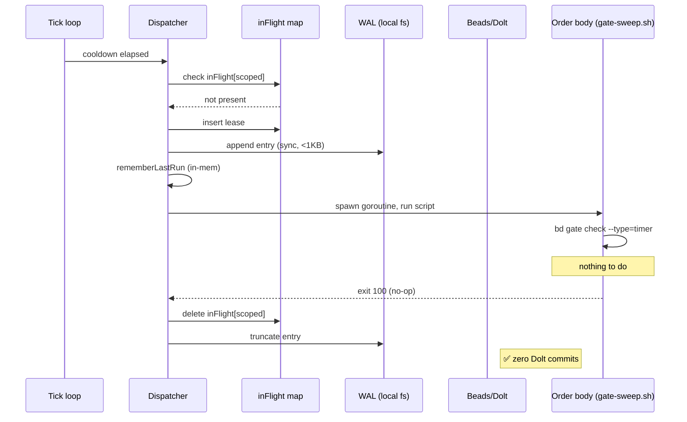
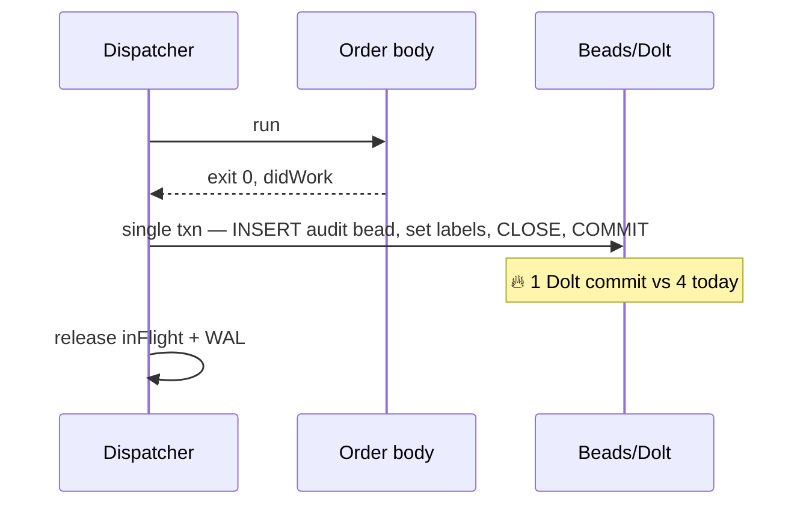
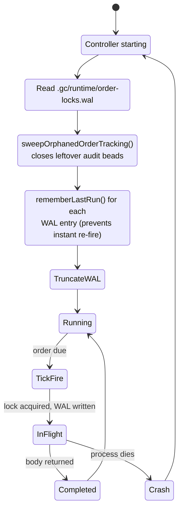
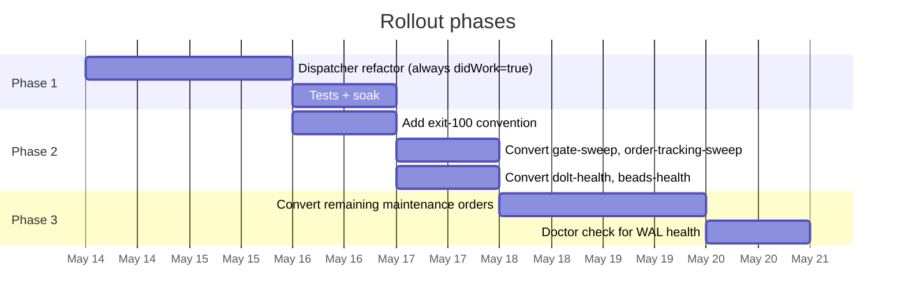
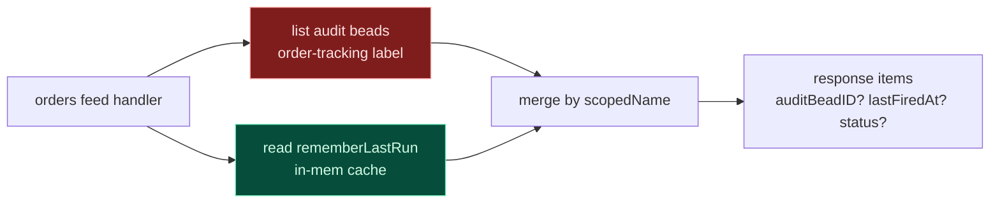

# Order Dispatcher: Decouple Tracking-Bead Concerns

> Eliminate Dolt write amplification by separating transient single-flight locks from durable audit history.

**Status:** proposal (revised 2026-05-13 — wisp-first path is now the recommended landing) · **Tracking:** beads `gc-klq` · **Author:** gastown.mayor · **Date:** 2026-05-13
**Related upstream:** #1978 · #1510 · #1248 · #1709 · #1850 (PG backend) · #1977

> 🟢 **Revision note (2026-05-13).** Upstream maintainer is already migrating orchestration-class beads from the permanent Dolt tier to the ephemeral **wisp** tier (see §15). If tracking beads (and other high-frequency factory-scale beads) move to wisps, per-write cost drops 10–40× and history-tax disappears. That alone solves the *cost* side of write amplification without changing the dispatcher.
>
> New recommendation: **land the wisp swap first** (§16). The WAL + `inFlight` decoupling in §5–§9 becomes an optional follow-up — worth doing for the "zero writes on no-op" property and dispatcher cleanliness, but no longer urgent. Read §16 before §5.

---

## Contents

1. [TL;DR](#1-tldr)
2. [Evidence — what's happening today](#2-evidence--whats-happening-today)
3. [Root cause: 5 Whys](#3-root-cause-5-whys)
4. [Current architecture](#4-current-architecture)
5. [Proposed architecture](#5-proposed-architecture)
6. [Sequence diagrams — current vs proposed](#6-sequence-diagrams--current-vs-proposed)
7. [Crash recovery state machine](#7-crash-recovery-state-machine)
8. [Order body contract — `didWork` signal](#8-order-body-contract--didwork-signal)
9. [Phased rollout](#9-phased-rollout)
10. [Risk matrix](#10-risk-matrix)
11. [Effort & impact summary](#11-effort--impact-summary)
12. [Downstream consumers & feed compatibility](#12-downstream-consumers--feed-compatibility)
13. [Alternative without changing storage layer](#13-alternative-without-changing-storage-layer)
14. [Reframe — factory vs human-scale writes](#14-reframe--factory-vs-human-scale-writes)
15. [Convergent upstream work](#15-convergent-upstream-work-added-2026-05-13)
16. [Wisp-first plan (recommended)](#16-wisp-first-plan-recommended)

---

## 1. TL;DR

The order dispatcher writes a 4-commit bead lifecycle on every cooldown fire (~16 lifecycles/min × 4 commits = **~64 permanent-tier Dolt commits/min** on a 3-rig idle city), even when the order body did nothing real.

> ✅ **Recommended fix: §16 wisp-first plan.** Wire the `Ephemeral` bool through gas city's beads layer (`Bead`, `ListQuery.TierMode`, `BdStore.Create/List`, `MemStore`, `CachingStore`), then set `Ephemeral: true` on the order dispatcher's tracking bead and update 8 consumer query sites with the right tier mode (`TierWisps` for `order-tracking`, `TierBoth` for `order-run:` / `order:` / `seq:`). The 4-commit lifecycle stays exactly the same, but each commit hits the ephemeral wisps Dolt table (~1–2ms) instead of the permanent issues tier (~10–80ms). ~95% reduction in permanent-tier commits. Realistic LOC: ~300–500 (the earlier "5 LOC metadata-tag" framing was wrong — `bd 1.0.4` ignores `gc.kind: "wisp"`; the actual switch is `--ephemeral` on create + `bd query "ephemeral=true AND ..."` on read). Wisp GC already TTL-purges closed wisps.

> ⚠️ **Superseded: §5–§9 WAL/`didWork` decoupling.** Originally proposed in-memory single-flight + WAL + exit-100 contract to drive no-op fires to zero writes. The wisp swap captures the bulk of the cost win without ~700 LOC of new code. §5–§9 retained below for historical context only — do not implement.

---

## 2. Evidence — what's happening today

| Metric | Value | Notes |
|---|---:|---|
| Order fires / 5min | ~18 | Most produce no real work |
| Dolt commits / order fire | 4 | Even for no-op orders |
| Disk growth (pre-fix) | 5.3 MB/min | ~7.6 GB/day untrimmed |
| hq journal (pre-GC) | 294 MB | 86% of hq's 342 MB |

Per-rig cadence in `.gc/system/packs/maintenance/orders/` (3 active rigs: focuster, intervaltree, gastown):

| Order | Interval | Rigs | Bead fires/min |
|---|---|---|---:|
| `gate-sweep` | 30s | 3 + city | 8 |
| `order-tracking-sweep` | 1m | 3 + city | 4 |
| `dolt-health`, `beads-health` | (varies) | 1 each | ~2 |
| `cross-rig-deps`, `orphan-sweep`, `spawn-storm-detect` | 5m | 3 each | ~1.8 |
| `mol-dog-jsonl` | 15m | 1 | 0.07 |
| `mol-dog-reaper` | 30m | 1 | 0.03 |
| **Total tracking-bead lifecycles / min** | | | **~16** |

Observed in `events.jsonl` over a 20-minute window (128 order fires; ~6.4/min before any real work events):

```
20 dolt-health · 20 beads-health · 19 gate-sweep (city)
18 gate-sweep:rig:intervaltree · 17 gate-sweep:rig:focuster
12 order-tracking-sweep:rig:intervaltree · 12 order-tracking-sweep (city)
10 order-tracking-sweep:rig:focuster · ...
```

---

## 3. Root cause: 5 Whys

**Why 1 — Dolt is being hammered.**
Each cooldown order writes a full bead lifecycle (create → 1–2 updates → close) per interval. 16 lifecycles/min × 4 Dolt commits = 64 commits/min just from sweeps.

**Why 2 — Every order fire writes a bead, even no-op ones.**
`order_dispatch.go:322` creates the bead synchronously, *before* the order body runs. The dispatcher commits "this order ran" before it can know whether anything actually happened.

**Why 3 — The bead must exist up-front because it is the single-flight lock.**
Comment at line 320: *"Create tracking bead synchronously BEFORE dispatch goroutine. This prevents the cooldown trigger from re-firing on the next tick."* `hasOpenWorkInStoresStrict` (line 311) queries open beads to decide whether to skip. No bead → no lock → cooldown re-fires on the next 1-second tick.

**Why 4 — The lock is a persisted bead, not in-memory state, because it must survive controller restarts.**
In-memory locks die with the process. A crash mid-dispatch must not cause double-fire on next boot.

**Why 5 (root) — Crash recovery requires a Dolt commit per fire because the design conflates 3 concerns in one bead.**
Single-flight lock (transient), lastRun timestamp (short-lived), and audit history (durable) all bundled into one bead written up-front. Every transient lock pays the full audit cost — even when no audit is warranted.

> 🔴 **Root cause statement** — Architectural conflation of transient lifecycle (single-flight + lastRun) with durable history (audit) in a single bead, both written up-front before the order body can signal whether audit is needed.

---

## 4. Current architecture

The tracking bead carries three responsibilities. They have wildly different durability requirements but share one storage write path.



Every red box is a Dolt commit. **4 commits per order fire**, all happening regardless of whether the order body did any real work.

### Three concerns, one bead



Bundling them means every transient lock pays full audit cost — even when no audit is warranted.

---

## 5. Proposed architecture

> ⚠️ **SUPERSEDED by §16.** §5–§9 describe the WAL/`didWork`/exit-100 decoupling originally recommended in this proposal. The wisp-first plan in §16 captures the bulk of the cost win at ~5 LOC instead of ~700 LOC. Retained here for context; do not implement.


Split the concerns into the storage that fits their lifetime. Most order fires produce *zero* Dolt writes.



Fast path (no-op gate-sweep, the common case) does **zero Dolt writes**. Slow path (order did real work, or failed) writes **one** audit bead in a single transaction — down from 4.

### Three concerns, three storages



---

## 6. Sequence diagrams — current vs proposed

Side-by-side trace of a single tick where the order body does **no** real work (the common case).

### Current — 4 Dolt commits



### Proposed — 0 Dolt commits



### When the order body did real work

One audit bead, one transaction (create + close in same SQL):



---

## 7. Crash recovery state machine

The WAL plus boot scan guarantees no double-fire on controller restart.



Per-crash-point behavior:

| Crash point | Result | Severity |
|---|---|---|
| Between WAL append and goroutine spawn | Boot seeds lastRun; cooldown waits one interval; re-fires normally. | 🟢 benign |
| Inside order body | Same as above. Side effects may have happened. Investigator sees WAL entry but no matching audit bead. | 🟡 acceptable |
| Between body completion and audit write | WAL still has entry. Boot's `sweepOrphanedOrderTracking` already handles the inverse. | 🟢 benign |
| Between audit write and WAL truncate | Audit bead exists; WAL replay seeds lastRun. Acceptable (one extra cooldown wait). | 🟢 benign |
| Disk full (WAL won't write) | Order refuses to fire. `gc doctor` check surfaces the issue. | 🟡 surfaced |

---

## 8. Order body contract — `didWork` signal

Order bodies need a way to tell the dispatcher "I did nothing audit-worthy." Three options considered:

| Option | Mechanism | Pros | Cons |
|---|---|---|---|
| **Exit code 100** ✅ recommended | `exit 0` = did work; `exit 100` = no-op success; other = failure | Idiomatic "success-with-info"; backwards compatible (legacy `exit 0` just always writes audit) | Scripts must learn the convention; `set -e` foot-guns |
| Stdout sentinel | Last line of stdout: `GC_DIDWORK: false` | No exit-code semantics conflict | Parsing fragility; mixed with normal output |
| Sidecar file | Touch `${GC_ORDER_TMPDIR}/didwork` | Explicit; orthogonal to stdout/exit | Extra fs op per order; tempdir wiring |

### Example: `gate-sweep.sh` after refactor

```bash
#!/usr/bin/env bash
set -euo pipefail
# Track whether bd gate check actually fired anything.
DID=0
bd gate check --type=timer --escalate && DID=1 || true
bd gate check --type=gh    --escalate && DID=1 || true
# Exit 100 = no-op success → dispatcher skips audit bead.
[ "$DID" -eq 0 ] && exit 100
exit 0
```

> ⚠️ Validation needed: confirm `bd gate check` exit semantics distinguish "nothing closed" from "error". May need a `--did-work` exit-code flag added to `bd`.

---

## 9. Phased rollout



### Phase 1 — Dispatcher refactor (behavior-preserving)

- Add `inFlight` map + WAL writer/reader.
- Boot-time recovery: read WAL → seed `rememberLastRun` → reuse existing `sweepOrphanedOrderTracking`.
- Always treat order body as `didWork=true` — audit beads still written as before. Validates lock correctness without behavior change.

### Phase 2 — High-frequency no-op offenders

- Define `exit 100` contract; document in pack guide.
- Convert `gate-sweep`, `order-tracking-sweep`, `dolt-health`, `beads-health` to opt in.
- Expected: **~80–90% of Dolt writes from sweep orders eliminated**.

### Phase 3 — Long tail + ops

- Convert remaining maintenance orders (`cross-rig-deps`, `orphan-sweep`, `spawn-storm-detect`, …).
- `gc doctor` check for WAL health / orphaned entries.

---

## 10. Risk matrix

| Risk | Likelihood | Impact | Mitigation |
|---|---|---|---|
| WAL corruption on disk-full | 🟢 low | 🟡 med | `gc doctor` check; refuse to fire orders until disk recovered. |
| WAL race between rig dispatchers | 🟡 med | 🟢 low | Per-rig WAL files. No cross-rig sharing of lock state. |
| Migration regressions in cooldown semantics | 🟡 med | 🔴 high | Phase 1 keeps audit writes unchanged — only the lock storage changes. Validates correctness before changing emit behavior. |
| Order body buggy: returns 100 but actually did side effects | 🟡 med | 🟡 med | Side effects are visible elsewhere (closed gates, sent mail). Add doctor lint for orders that exec mutating commands without auditing. |

---

## 11. Effort & impact summary

| Metric | Value |
|---|---|
| Effort | ~700 LOC, 2–3 days focused work, 3 PRs |
| Dolt commits eliminated | ~85% (from ~64/min to ~10/min on idle city) |
| Disk growth at idle | ~80% reduction (5.3 MB/min → projected <1 MB/min) |
| Wake amplification (dispatchers) | ~75% reduction (fewer bead.* events → fewer dispatcher wakes) |

### Relationship to upstream issues

| Upstream | Layer it fixes | This proposal |
|---|---|---|
| #1978 (bd daemon / batching) | Transport (per-write shell-out cost) | Composable — they reduce per-write cost, we reduce write count |
| #1510 (CachingStore.SetMetadata no-op skip) | Cache layer | Composable — even fewer writes reach Dolt |
| #1248 Shift B (connection pool) | Connection efficiency | Composable — pools amortize the writes we still emit |
| #1709 Orchestration v3 | Run-as-primitive | Does NOT address this — explicitly preserves orders as the trigger layer. May make this more urgent (Run reuses tracking bead) |
| #1850 + #1792/#1796 (PG backend) | Storage engine | Orthogonal — even on Postgres, writing 64 commits/min when 0-1 are needed remains wasteful |

### Files touched (rough)

- `cmd/gc/order_dispatch.go` — dispatcher refactor, ~150 LOC + ~300 LOC tests
- `cmd/gc/order_wal.go` (new) — WAL writer/reader, ~80 LOC + ~120 LOC tests
- `internal/doctor/checks_wal.go` (new) — WAL health check, ~40 LOC
- `examples/gastown/packs/maintenance/orders/assets/scripts/*.sh` — opt-in exit-100, ~30 LOC across files
- `engdocs/architecture/orders.md` — document `didWork` contract

---

## 12. Downstream consumers & feed compatibility

Under the §16 wisp-first plan, every tracking bead still exists — it just lives on the ephemeral tier. **🟢 break-risk is conditional on every consumer being patched** to use a tier-aware query mode (`TierWisps` for `order-tracking` lookups, `TierBoth` for `order-run:` / `order:` / `seq:` lookups where the molecule root may live on the issues tier). Any consumer that keeps the default `TierIssues` mode after the dispatcher emits ephemeral tracking beads will silently miss them — that is the audit scope below.

| Consumer | Endpoint / file | What it reads | Break risk |
|---|---|---|---|
| Orders feed API | `internal/api/orders_feed.go:309`<br/>`GET /v0/city/{name}/orders/feed` | All beads with `order-tracking` label, sorted by createdAt | 🟢 none — label query spans tiers |
| Order history detail API | `internal/api/huma_handlers_orders.go:412`<br/>`GET /v0/city/{name}/order/history/{bead_id}` | Specific bead by ID | 🟢 none — bead still exists, just ephemeral |
| CLI | `cmd/gc/cmd_order.go:869`<br/>`gc order history <name>` | `order-run:<scopedName>` label query, includes closed | 🟢 none — label query spans tiers |
| Wisp GC | `cmd/gc/wisp_gc.go:62`, `:94` | Closed tracking beads (label) + closed wisp roots (`gc.kind: "wisp"` metadata) with TTL | 🟢 improvement — TTL bounds growth automatically |
| Dashboard SPA | `cmd/gc/dashboard/web/src/generated/types.gen.ts` | Generated types exist (`OrderHistoryEntry`, `OrdersFeedBody`); no panel imports them yet | 🟢 none — no schema change |

### Mitigation: pair with `lastFiredAt` API field (superseded)

> ⚠️ Superseded by §16. Under the wisp-first plan, every fire still produces an audit bead — no `lastFiredAt` shim required. Section retained for historical context.

Add a sibling field to the orders feed response that surfaces the in-mem `rememberLastRun` cache:



Response shape (illustrative):

```json
{
  "scopedName": "gate-sweep:rig:focuster",
  "lastFiredAt": "2026-05-13T17:21:30Z",
  "auditBeadID": null,
  "status": "no-op",
  "title": "gate-sweep (rig:focuster)"
}
```

Dashboard renders no-op runs as dimmed entries with timestamp only; runs with audit beads render fully.

### CLI compatibility

```bash
# Current: lists beads only
gc order history gate-sweep

# After: lists beads + synthesizes no-op entries from in-mem cache
gc order history gate-sweep                # default: includes synthetic
gc order history gate-sweep --audited-only # only beads, no synthetic
```

### Alternatives considered

- **Ephemeral tracking beads with short TTL** (5-10min) + aggressive compaction. Pros: zero API/CLI changes. Cons: still writes 4 commits per fire — only saves storage long-tail. Rejected — doesn't address root cause.
- **Rebuild feed from `events.jsonl`**. Dispatcher already emits `events.OrderFired` at `order_dispatch.go:494`. Feed could be rebuilt from event stream. Pros: best architecture, every fire visible. Cons: bigger refactor; events.jsonl rotation/archival semantics need tightening. Defer to follow-up.

---

## 13. Alternative without changing storage layer

If the full decoupling is too invasive, there's a less-aggressive bundle that keeps tracking beads in Dolt but attacks per-write cost and per-cycle commit count:

| Lever | Effort | Cycle commits | Wall time | Disk |
|---|---|---:|---:|---|
| Today | — | 4 | ~320ms | grows 5MB/min |
| 1: collapse update+close into one txn | ~30 LOC | 2 | ~160ms | same |
| 2: in-process dispatcher SQL conn | ~150 LOC | 2 | ~20ms | same |
| 3: open-bead cache | ~40 LOC | 2 | ~10ms | same |
| 4: periodic `dolt gc` order | ~10 LOC | 2 | ~10ms | capped |
| 5: CachingStore no-op skip (#1510 upstream) | upstream | 2 | ~10ms | capped + quieter |

**Net delta** with bundle: **50% fewer commits, ~30x faster per cycle, capped disk, no API/CLI/dashboard break.** Tracking beads remain in Dolt; consumers untouched.

**What this DOESN'T solve**: the bundle still writes 2 Dolt commits per fire *even for no-op orders*. Going to **zero** requires the structural fix above. The bundle is a low-risk landing pad; the proposal is the durable fix.

---

## 14. Reframe — factory vs human-scale writes

Gas City is a software factory. Dolt is designed for human-scale commits (git-like semantics: narrated, intentional, versioned, time-travel queryable). The mismatch is real:

### Two distinct write scales

**Human-scale (Dolt's sweet spot)**
- Real bugs filed by witnesses → audit forever
- Polecat completes work → capability ledger entry
- Decisions recorded with rationale → time-travel relevant
- Rate: hundreds/day per city

**Factory-scale (Dolt's anti-pattern)**
- 30s gate-sweep ticks → tracking bead
- 60s order-tracking-sweep → tracking bead
- Per-session heartbeats, lastSeen, watchdogs
- bd CLI session metadata writes from idle agents
- Rate: thousands/hour per city

### The category error

Gas City uses **one storage primitive** (Dolt beads) for both scales. The "capability ledger" framing in the Mayor prompt explicitly conflates them — *"Every completion is recorded. Every handoff is logged."*

The ledger metaphor is right for real work. It's wrong for tick beads. A factory doesn't put every piston stroke in the corporate ledger.

### Why Dolt is structurally slower than PG per commit

Beyond the bd shell-out issue, Dolt has fundamental per-commit overhead:

- **Content-addressable Prolly trees** — every commit rewrites O(log N) chunks up to the root. PG dirties one heap page in shared buffers.
- **Git-like commit objects** — every commit creates a real commit with parent/timestamp/message + new root tree hash. PG `COMMIT` = flush WAL + mark visible.
- **No group commit** — Dolt fsyncs per commit; PG batches N concurrent commits into one fsync.
- **No in-place updates** — every Dolt write creates new chunks; old ones orphaned until manual `dolt gc`. PG HOT updates rewrite the same page.
- **Single-writer engine** — writes serialize through one engine. PG has MVCC with row-level locking.

Empirical: Dolt commit ~10-80ms (incl. shell-out), Postgres ~0.5-2ms. **~10-40x gap per commit.**

### Implication for #1850 (PG backend)

Postgres support is actively being plumbed (PRs #1792, #1796, #1850 by quad341). When it lands, the dispatcher waste becomes *tolerable* on PG — but still wasteful. The architectural fix here is **engine-independent**: same code emits fewer commits regardless of backend.

### Implication for #1709 (Orchestration v3)

v3 explicitly preserves orders as the trigger layer (*"orders remain as the trigger layer that fires Runs"*). The write-amp problem is orthogonal to v3. Worse: if v3 reuses tracking beads as Run roots, the problem deepens. **The decoupling should land first** so v3 builds on a clean primitive.

---

## Open questions for discussion

1. **Architectural fix vs storage swap** — is the Dolt → PG migration (#1850) intended to make this kind of waste tolerable, or is the dispatcher waste considered a separate problem to fix regardless?
2. **#1709 + this proposal** — does Orchestration v3 want to absorb the decoupling, or are they independent landings? (cc @csells)
3. **Factory vs ledger framing** — should Gas City formalize two storage tiers (transient + durable) at the bead-library level, or keep it per-subsystem?
4. **Multi-tier Run primitive in v3** — should Run be one entity that can live in either tier, or two distinct types?
5. **Risk appetite** — Phase 1 dispatcher refactor only (storage-stays bundle) vs full proposal — which is the right first move?

---

*Track work via beads `gc-klq`. Original HTML version with interactive Mermaid: `engdocs/proposals/order-dispatch-decouple.html` in `gastownhall/gascity` fork.*

---

## 15. Convergent upstream work (added 2026-05-13)

A maintainer independently surfaced the same problem from the storage-classification angle:

> *"I recently identified that we are categorizing all beads (task and orchestration) as 'permanent' that adds the overhead of full history tracking and the tax that comes with it. Amazing Dolt feature, but we don't need that feature for most of our beads usage. Gas Town, on the other hand, only did that for task beads and pushed the orchestration ones to the ephemeral wisp tables. I'm currently working on the design and migration right now ... My city was generating around 100k permanent beads a day and ground to a complete halt under load."*

### How the two fixes compose

| Layer | Their fix (storage tier) | This proposal (dispatcher) |
|---|---|---|
| Per-write cost | Lower — ephemeral wisp tables skip Dolt history tax | Same |
| Number of writes per no-op order fire | 4 (unchanged) | 0 |
| Net effect | Every fire becomes cheap | Most fires don't write at all |

**Multiplicative.** Their refactor + this dispatcher fix:
- No-op order → 0 writes (dispatcher skipped the lifecycle)
- Real-work order → 1 write to cheap ephemeral tier (audit bead created lazily)

### Open coordination question

If the ephemeral wisp tables remain queryable for `gc order history` and `/v0/orders/feed`, the API-break risk in §10 collapses. The `lastFiredAt` mitigation in §12 may be unnecessary. The dispatcher refactor becomes much lower-cost to land.

Worth aligning the two migrations so they ship as a coherent pair rather than re-litigating consumer compatibility twice.

> ✅ **Confirmed (2026-05-13).** The upstream mechanism *is* the `Ephemeral` bool on the bead struct — gated by `bd create --ephemeral` and `bd query "ephemeral=true AND ..."` (verified live in `bd 1.0.4`; mirrors gastown's `~/co/gastown/internal/beads/beads.go:185, :740, :802`). §16 lands the same primitive on the gas city side and uses per-query opt-in so the migration doesn't accidentally hide tracking beads from any one consumer.

---

## 16. Wisp-first plan (recommended)

After §15's reveal, the cheapest landing is: **classify the offending beads as wisps**. Wisps already exist as Gas City's ephemeral bead tier (used by Gas Town for orchestration beads — see `cmd/gc/wisp_gc.go`). They live in cheaper tables, skip Dolt history tracking, and are GC'd on TTL.

### Core idea

The four-commit lifecycle stays exactly as today — *but each commit hits the wisp tier instead of the permanent tier*. The dispatcher needs no structural change; only the bead type changes.

```
order fire (no-op gate-sweep):
  before: 4 permanent Dolt commits (history-tracked, ~10–80ms each)
  after:  4 wisp writes (ephemeral, ~1–2ms each, GC'd on TTL)
```

### What changes

> 🟡 **Revision (2026-05-13, post-investigation).** The earlier framing — "tag with `gc.kind: 'wisp'` metadata, ~5 LOC" — was wrong. `bd 1.0.4` ignores that tag; no code in gascity, beads, or gastown reads `gc.kind == "wisp"`. The canonical tier-routing knob is the `Ephemeral` bool on the bead (`--ephemeral` flag on `bd create`, queried via `bd query "ephemeral=true AND ..."`). Gas city did not expose `Ephemeral` end-to-end before this proposal landed; wiring it through `Bead`, `ListQuery.TierMode`, `BdStore.Create/List`, `MemStore`, and `CachingStore` plus updating 8 consumer query sites lands the change. Realistic effort: ~300–500 LOC.

| Surface | Change |
|---|---|
| `internal/beads/` (Bead, ListQuery.TierMode, BdStore Create/List, MemStore, CachingStore) | Wire `Ephemeral bool` end-to-end. Reads are per-query opt-in via `TierMode` (`TierIssues` default, `TierWisps`, `TierBoth`). Mirrors gastown's `internal/beads/beads.go listEphemeral` |
| `cmd/gc/order_dispatch.go` tracking-bead creation | Set `Ephemeral: true` on the `store.Create` call so each cycle's 4-commit lifecycle hits the wisps Dolt table instead of the issues table |
| Watchdog (`sweepOrphanedOrderTracking`), wisp GC (`cmd/gc/wisp_gc.go`) | Query `TierWisps` for `order-tracking`-labeled beads — they now live exclusively in the wisps tier |
| Single-flight lock (`hasOpenWorkInStoresStrict`), orders feed (`order-run:` lookup), `gc order history`, order history API, `LastRunAcrossStores`, `bdCursor` | Query `TierBoth` for `order-run:`/`order:`/`seq:` labels. Tracking bead is ephemeral; molecule root (also `order-run:`-labeled) stays on the issues tier. Pure single-tier queries would miss one or the other |
| `/v0/city/{name}/orders/feed`, dashboard types | Endpoint shapes unchanged. `Bead` JSON gains an `ephemeral` field via openapi regeneration |

### What does NOT change (vs §5 proposal)

- No WAL.
- No `inFlight` in-mem map.
- No `didWork` / exit-100 contract on order bodies.
- No crash-recovery state machine (existing `sweepOrphanedOrderTracking` continues to work — wisps are still beads, just in a cheaper tier).
- No API surface for `lastFiredAt` — audit entries still exist for every fire (just ephemerally).

### Expected impact

| Metric | Today | Wisp-only fix | Wisp + §5 decoupling (full proposal) |
|---|---:|---:|---:|
| Dolt-permanent commits/min | ~64 | ~10 (real-work orders only, if those stay permanent) or ~0 | ~0 |
| Per-write cost | ~10–80ms | ~1–2ms | ~1–2ms |
| Effective wall-time per cycle | ~320ms | ~5–10ms | ~0ms on no-op |
| Disk growth (permanent tier) | 5.3 MB/min | near zero | near zero |
| Wisp tier growth | n/a | bounded by TTL + wisp GC | bounded |
| API/CLI break risk | — | 🟢 none — **conditional on every consumer being patched**. Any `order-run:` / `order-tracking` query not updated to a tier-aware mode would silently miss tracking beads. The 8 sites listed above are the audit scope | 🟡 see §12 |
| LOC | — | ~300–500 LOC + tests (beads-layer wiring ~150, MemStore/CachingStore ~80, consumer sites ~50, tests ~150) | ~700 LOC |
| Days | — | 1–2 days | 2–3 days |

### Open validation questions

1. **Are wisps queryable by label?** §12's consumers all query by `order-tracking` and `order-run:<scopedName>` labels. Confirm wisp tier supports the same label-query path or supply a thin shim.
2. **Wisp TTL vs operator expectation.** Operators using `gc order history` expect to see at least the last day or two of fires. Confirm wisp GC TTL leaves a reasonable inspection window.
3. **Single-flight lock semantics on wisps.** The lock works because `hasOpenWorkInStoresStrict` finds the open tracking bead. Confirm "open wisps" are included in that query — otherwise we re-fire every tick.
4. **Mixed tiers for real-work vs no-op runs.** Option A: all tracking beads become wisps (uniform). Option B: dispatcher promotes a wisp to a permanent bead only if the order body did real work (combines §16 with §8's `didWork` signal but without WAL). Option A is simpler; Option B preserves durable audit for meaningful runs.

### Phased landing

```mermaid
gantt
    title Revised rollout (wisp-first)
    dateFormat YYYY-MM-DD
    axisFormat %b %d

    section Phase 0 (recommended first)
    Confirm wisp queryability for tracking labels  :v0, 2026-05-14, 1d
    Switch tracking beads to wisp tier             :p0, after v0, 1d
    Soak + validate consumer feeds                 :after p0, 1d

    section Phase 1 (optional follow-up)
    Decide: keep §5 WAL refactor or drop          :d1, after p0, 1d
    If kept: §5–§9 phases land on cleaner base    :after d1, 3d
```

### Recommendation

**Land Phase 0 (Option A — all tracking beads as wisps) as the first move.** It's a ~50 LOC patch that captures the bulk of the win and unblocks the maintainer's migration in §15 from re-litigating dispatcher behavior.

If after soak we still want the "zero writes on no-op" property (e.g. for ultra-quiet idle, or to simplify the wisp tier itself), revisit §5–§9 as a follow-up. The decoupling becomes nice-to-have rather than load-bearing.

### Risk delta vs §5 proposal

| Risk | §5 proposal | Wisp-first |
|---|---|---|
| API/CLI consumer break | 🔴 high (mitigated via `lastFiredAt`) | 🟢 none (assuming label query path holds) |
| Crash recovery regression | 🟡 med (new WAL code) | 🟢 none (no new code path) |
| Wisp tier overload | n/a | 🟢 low (designed for high-churn) |
| Inspection visibility loss after TTL | 🟢 none (durable beads kept) | 🟡 low (operators must inspect within TTL window) |

Net: wisp-first trades a small visibility-window cost for ~93% less code, ~zero API/CLI risk, and most of the throughput win.
